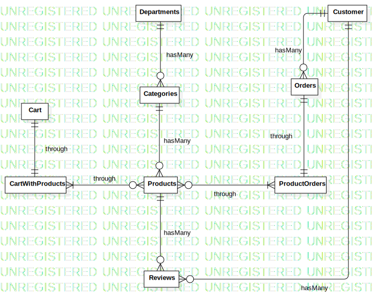

# e-commerce

## Intro 
This repository contains backend code for an e-commerce webiste written on NodeJS and ExpressJS. The database used is MySQL with the help of Sequelize ORM. It has token based authentication implemented with the help JWT.

## Setup Instructions :page_facing_up:
- Clones the repo onto your systems.
- Install Node from this [link](https://nodejs.org/en/download/).
- After installing node, open up a Terminal or Powershell inside the cloned repo folder.
- Then run `npm install`, this will install all the dependencies. (Run `npm install --dev` in case Dev Dependencies are not installed).

## Execution Instructions 
- In the cloned repo folder inside the `config` folder , create a file name `dev.env`
- Paste in your environment variables in this format :  
` PORT=<EXPRESS_PORT>`  
  `DB_IP=<MYSQL_PORT>`  
  `DB_USER=<DB_USERNAME>`  
  `DB_PASSWORD=<DB_PASSWORD>`  
  `DB_NAME=e-commerce`  
  `JwT_SECRET=<JWT_SECRET_FOR_ENCRYPTION>`  
`
- Run your Database Server (You can create a MySQL Apache server using [XAMPP](https://www.apachefriends.org/download.html)).
- Create a DB named `e-commerce` using your `phpMyAdmin` dashboard.
- Add a script in `scripts` in `package.json` : `"dev":"env-cmd -f src/config/dev.env nodemon src/index.js"`.
- Now Run `npm run dev` in the terminal.
- Now visit `localhost:3000/sync` to create tables automatically in the DB.
- Download Postman Collection from below and start hitting the APIs :rocket:

## ER Diagram

## Postman Collection 
Download Postman Collection from this [link](https://www.getpostman.com/collections/4029f44c1388a7657123)

## Video Demo
You can watch [this video](https://youtu.be/Cewd6Xgpr10) for detailed explanation.
